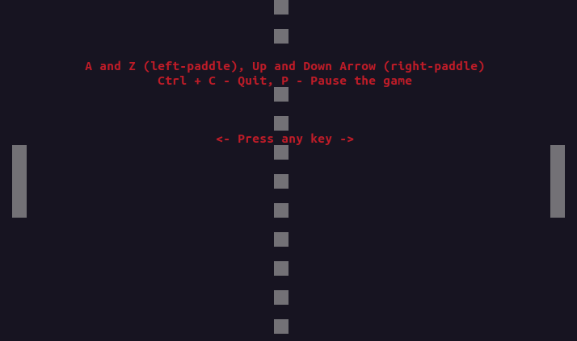
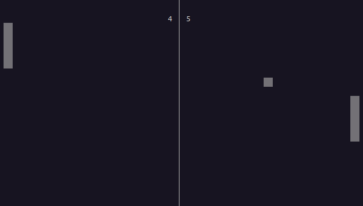

# Pong Game using `ncurses` Library

## Overview

This is an implementation of the classic Pong game using the `ncurses` library in C. The game simulates the traditional Pong gameplay, where two paddles move vertically to bounce a ball back and forth across the screen.

## Features

- **Two-player mode:** Play against a friend on the same keyboard.
- **Smooth animation:** The game runs smoothly using `ncurses` for console-based graphics.
- **Controls:**
  - **Left Paddle (Player 1):** `A` (Up), `Z` (Down)
  - **Right Paddle (Player 2):** `Up Arrow` (Up), `Down Arrow` (Down)
  - **Pause/Resume:** Press `P` to pause or resume the game.
  - **Quit:** Press `Ctrl + C` to quit.

## Requirements

- **C Compiler:** You need a C compiler like `gcc`.
- **ncurses Library:** Install the `ncurses` library on your system. On Ubuntu, use:
   ```bash
   sudo apt-get install libncurses5-dev libncursesw5-dev
   ```

## Installation and Running

**Clone the Repository:**
   ```bash
   git clone https://github.com/Jappanjot26/C-Language.git
   ```

**Navigate to the Pong Game Directory:**
   ```bash
   cd C-Language/Pong\ Game\ \(\ project\ \)/
   ```

**Try Running the Pre-Compiled Output:**
   ```bash
   ./output
   ```

**If the `output` file doesn't work, follow these steps:**
   1. Compile the implementation file:
      ```bash
      gcc -c pong_implementation.c -o pong_out
      ```
   2. Create a static library:
      ```bash
      ar rcs pong_library.a pong_out
      ```
   3. Compile the main program:
      ```bash
      gcc main.c -o output -L. pong_library.a -lncurses
      ```
   4. Run the program:
      ```bash
      ./output
      ```

## Snapshots

### Starting Screen


### Gameplay Screen

      
## Contact Me

If you have any questions, suggestions, or feedback, feel free to reach out to me at:

**Email:** singhjappanjot1@gmail.com  
**LinkedIn:** [Jappanjot Singh](https://www.linkedin.com/in/jappanjot-singh-275440257)

